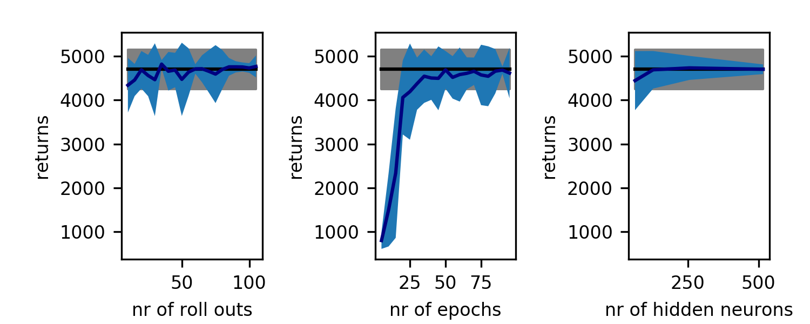
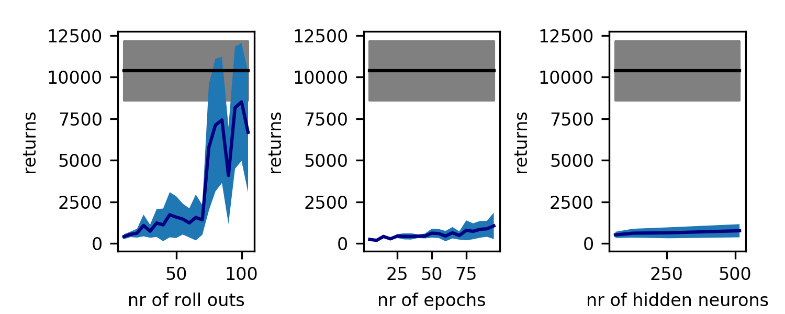
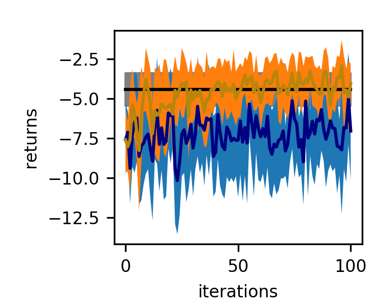
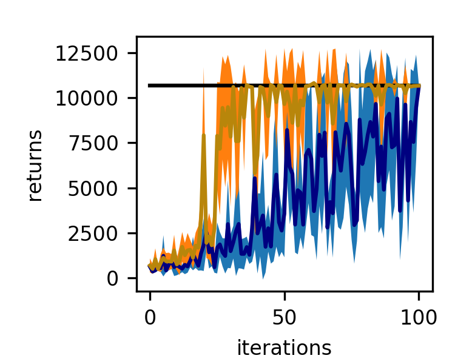

# CS294-112 HW 1: Imitation Learning

## Behavioral Cloning

A neural network with one hidden layer is trained by supervised learning to
imitate the provided expert policy.

The table below compares the total sum of rewards along a trajectory (returns)
for an agent following the expert and the learned policy. Returns are averaged
across 100 roll outs. The network is trained on 20 roll outs with 128 neurons
in the hidden layer and 50 training epochs.

| environment | returns expert     | returns model  |
| ------------|:-------------:| -----:|
| Ant         | 4740 ± 91 | 4584 ± 488 |
| HalfCheetah | 4147 ± 77 | 3848 ± 231 |
| Hopper      | 3779 ± 4.1 | 927 ± 14.2 |
| Humanoid    | 10294 ± 1923 | 401 ± 157 |
| Reacher     | -3.66 ± 1.47 | -7.13 ± 2.84 |
| Walker2d    | 5525 ± 60.6 | 625 ± 1024 |

The model achieves comparable results to the expert for the Ant, intermediate
results for the HalfCheetah, the Reacher and struggles with the Humanoid, the
 Hopper and the Walker2d. The following figures explore model performance in
 the Ant and the Humanoid environment when changing the number of roll outs
 the network is trained on, the number of training epochs and the size of the
 hidden layer. The model performs well for the Ant for most hyperparameters.
 In the Humanoid environment, the algorithm needs a certain number of roll outs
 in the training set to perform well.

*Ant environment. If not varied the network is trained on 20 roll outs with 128
neurons in the hidden layer and 50 training epochs. *

*Humanoid environment. If not varied the network is trained on 20 roll outs with
128 neurons in the hidden layer and 50 training epochs. *

## DAgger

The training set is iteratively extended by new data and used to re-fit
the model. New observations are collected by running the current policy and
new actions are labeled by the expert policy.

The figures below shows how the total reward increases when training an agend in
the Reacher and the Humanoid environment. DAgger improves performance faster over
iterations than behavioral cloning, where the training set is kept fixed.

*Initial network is trained on 20 roll outs, with 50 epochs and 128 hidden
neurons. In each aggregation step one roll out is added and the network is
trained for 5 epochs. Returns are averaged over 10 roll outs. black:expert,
blue: BC, orange: DAgger*

*Initial network is trained on 20 roll outs, with 50 epochs and 128 hidden
neurons. In each aggregation step one roll out is added and the network is
trained for 5 epochs. Returns are averaged over 10 roll outs. black:expert,
blue: BC, orange: DAgger*

## Code

create_figures.py includes
 * plotting routines
 * algorithm for behavioral cloning and DAgger

## Dependencies:
(from course notes)
 * Python **3.5**
 * Numpy version **1.14.5**
 * TensorFlow version **1.10.5**
 * MuJoCo version **1.50** and mujoco-py **1.50.1.56**
 * OpenAI Gym version **0.10.5**

Once Python **3.5** is installed, you can install the remaining dependencies using `pip install -r requirements.txt`.

**Note**: MuJoCo versions until 1.5 do not support NVMe disks therefore won't be compatible with recent Mac machines.
There is a request for OpenAI to support it that can be followed [here](https://github.com/openai/gym/issues/638).

**Note**: Students enrolled in the course will receive an email with their MuJoCo activation key. Please do **not** share this key.

The only file that you need to look at is `run_expert.py`, which is code to load up an expert policy, run a specified number of roll-outs, and save out data.

In `experts/`, the provided expert policies are:
* Ant-v2.pkl
* HalfCheetah-v2.pkl
* Hopper-v2.pkl
* Humanoid-v2.pkl
* Reacher-v2.pkl
* Walker2d-v2.pkl

The name of the pickle file corresponds to the name of the gym environment.
