# CS294-112 HW 2: Policy Gradient

## Cart Pole (Problem 4)

The following figures compare the performance of policy gradient in the <em>CartPole-v0</em> environment for small batch size (sb) and large batch sizes (lb). Small batches sample 1000 state-action pairs at each iteration, large batches sample 5000 state-action pairs and the network is trained for 100 iterations. The figures below compare performance of the algorithm with (rtg) and without reward to go (no_rtg) and with (na) and without (dna) normalization of the advantage. Results are averaged over three experiments. Policy gradient works best with reward to go and normalized advantages. Larger batch sizes stabilize the training process. This is reflected in reduced noise across experiments.

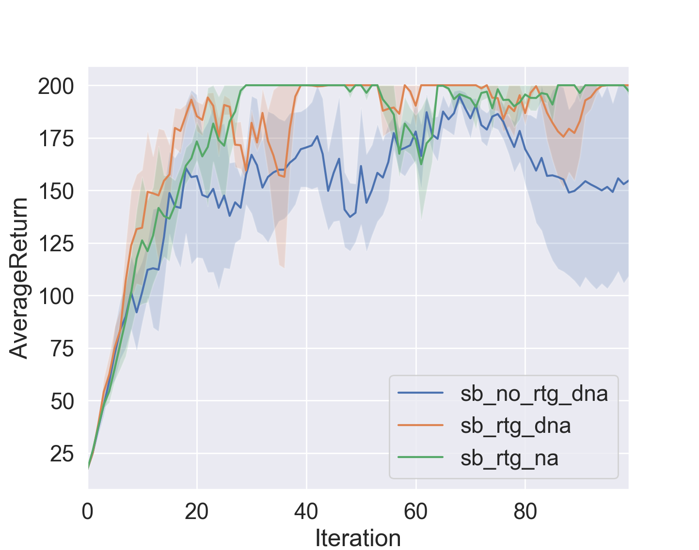
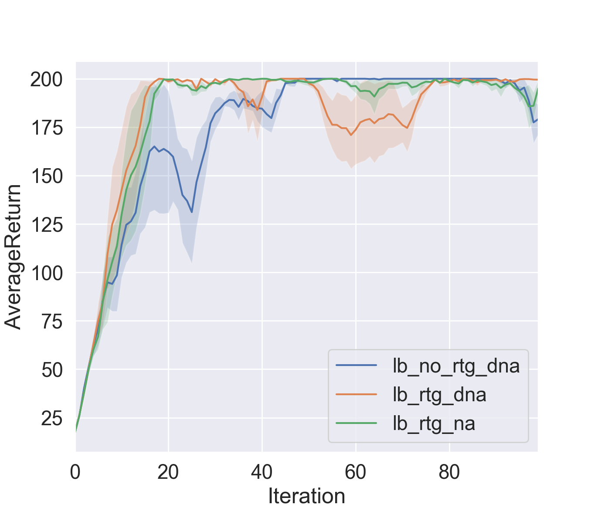

## Inverted Pendulum (Problem 5)

The figure below shows a grid search of the maximal reward achieved in 100 iterations in the <em>InvertedPendulum-v2</em> averaged over three experiments depending on various batch sizes and learning rates.
The next figure shows the performance of three training runs (each averaged over three experiments) for small batch sizes and large learning rates. All three receive the optimum reward of 1000 before 100 iteration but fluctuations are large for batch sizes this small and learning rates this large.

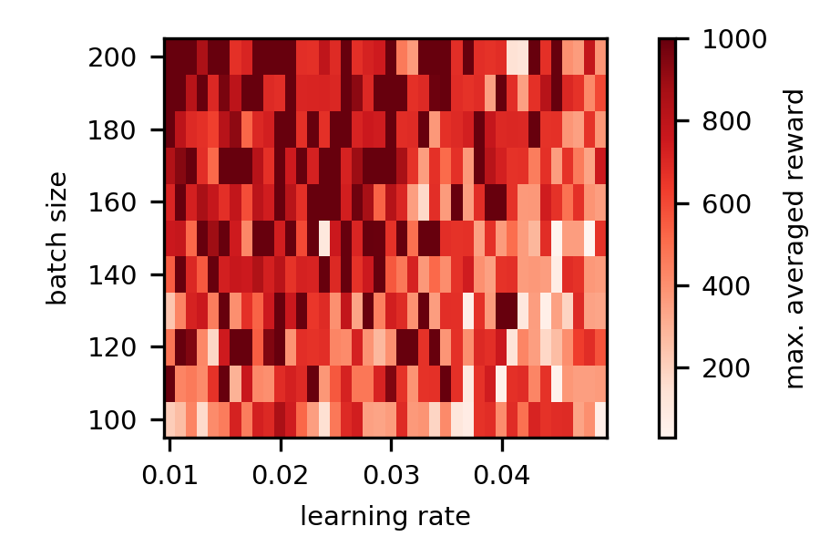
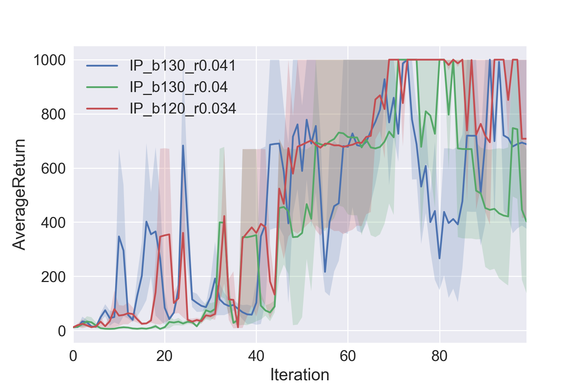

## Lunar Lander (Problem 7)

The figure below shows training performance in the <em>LunarLander-v2</em> environment average over three experiments.

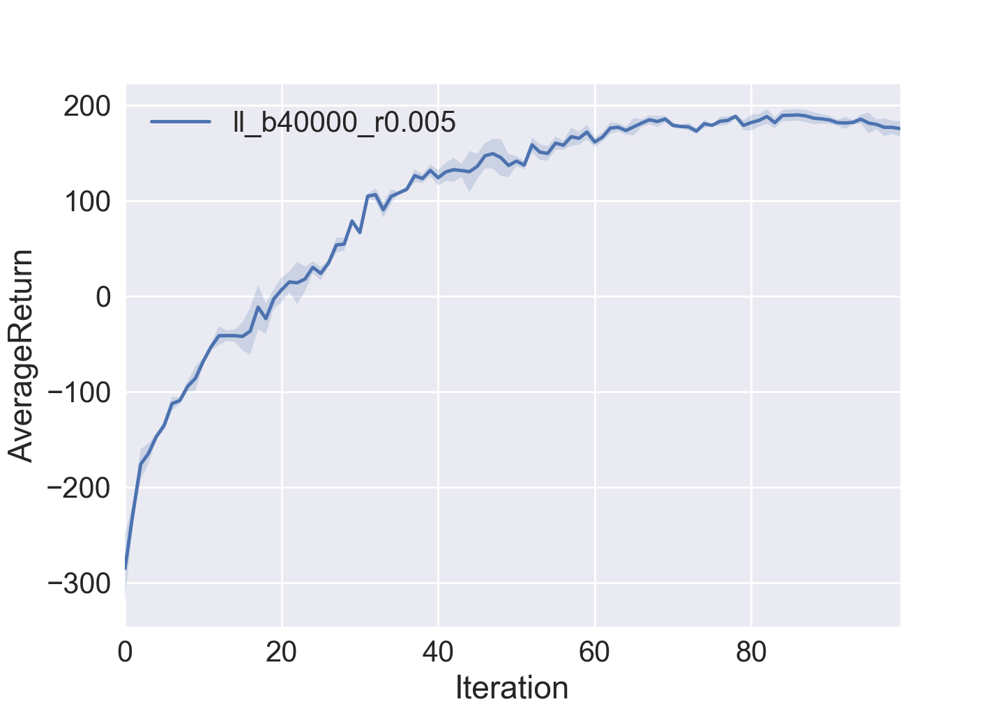

Choosing comparable hyperparameter for the vanilla policy gradient (vpg) of
the spinningup library from OpenAI shows better performance. The green curve
shows performance for lambda=1 when using generalized advantage estimation (GAE),
which corresponds to an advantage calculated as the discounted sampled future
reward minus a prediction of the value function (as implemented for the homework).
Using lambda=0.97 reduces variance in the advantage estimate which is traded in
for a small bias. The blue curve shows that the algorithm learns faster but fluctuates
stronger and is therefore less stable.

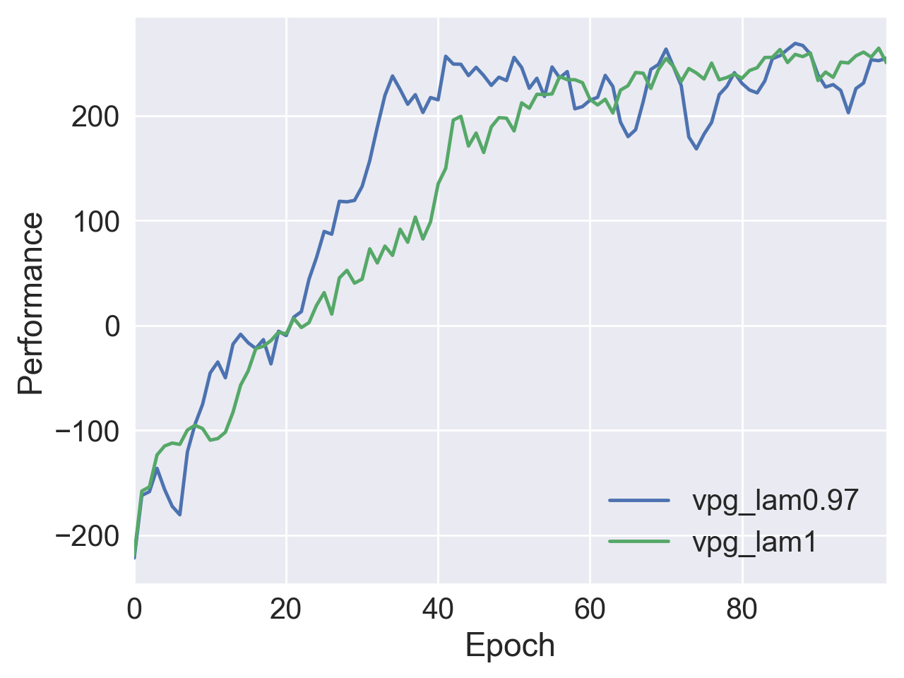

The next figures shows the performance of the PPO algorithm of spinningup for
different values of the clip_ratio (cr) and the target_kl (tk). Both parameters
determine how much the old and new policy are allowed to diverge from each other.
If the clip_ratio and the target_kl are too small performance goes up but
converges at lower values, if they are too large performance crashes. For
intermediate values performance converges to values larger than achieved by VPG.

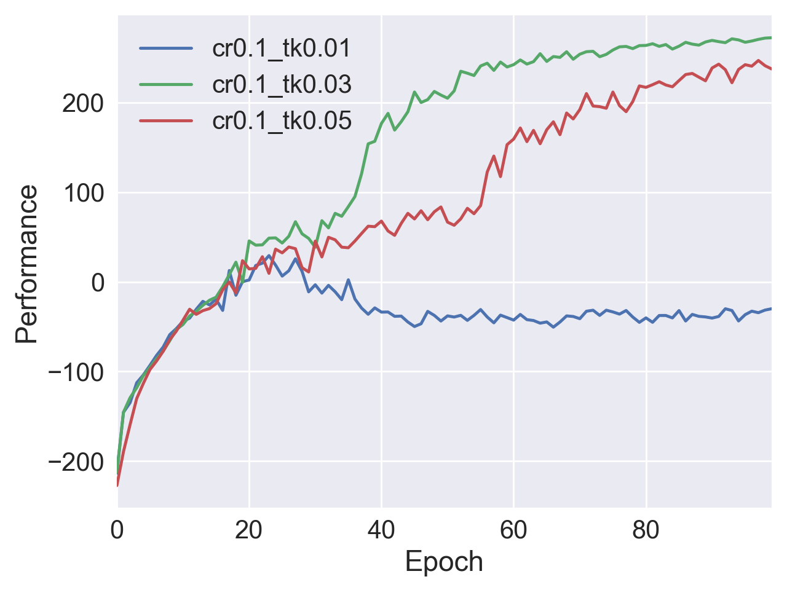
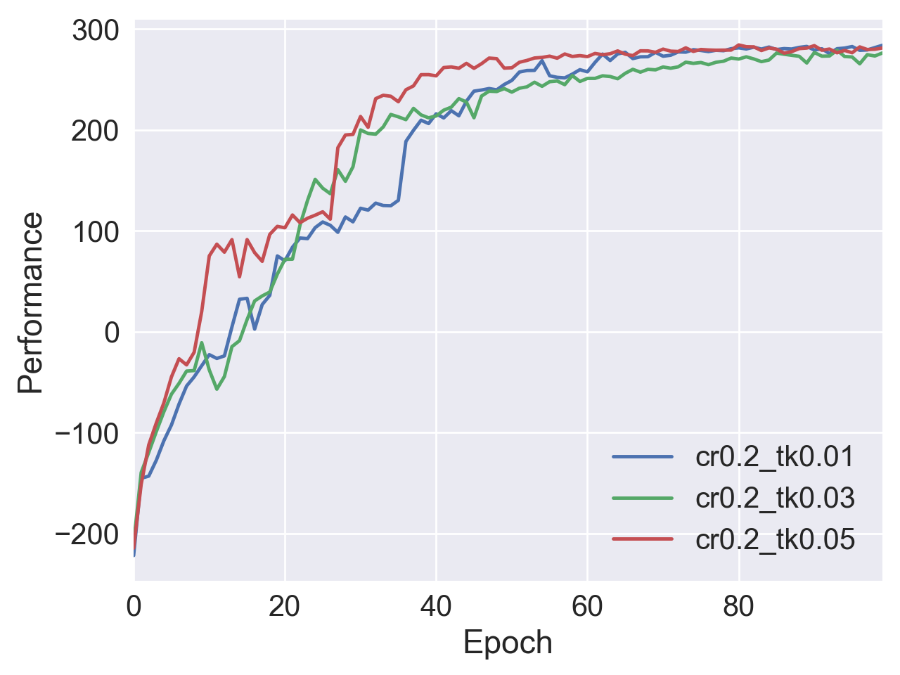
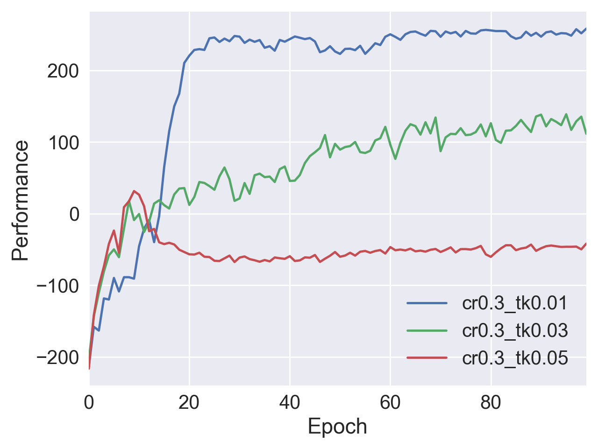

The next figures shows the performance of the TRPO algorithm of spinningup for
different values of the backtrack_coeff (bc) and delta. The first parameter reflects
the length of backtracking line search and the second the accepted distance between
old and new policy. Training performance shows that the backtracking coefficient
needs to be above a certain threshold. The algorithm performs best for small distances
between old and new policy, but in general not better than VPG.

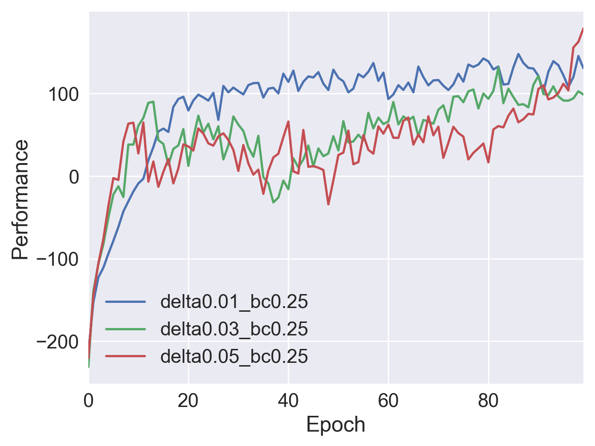
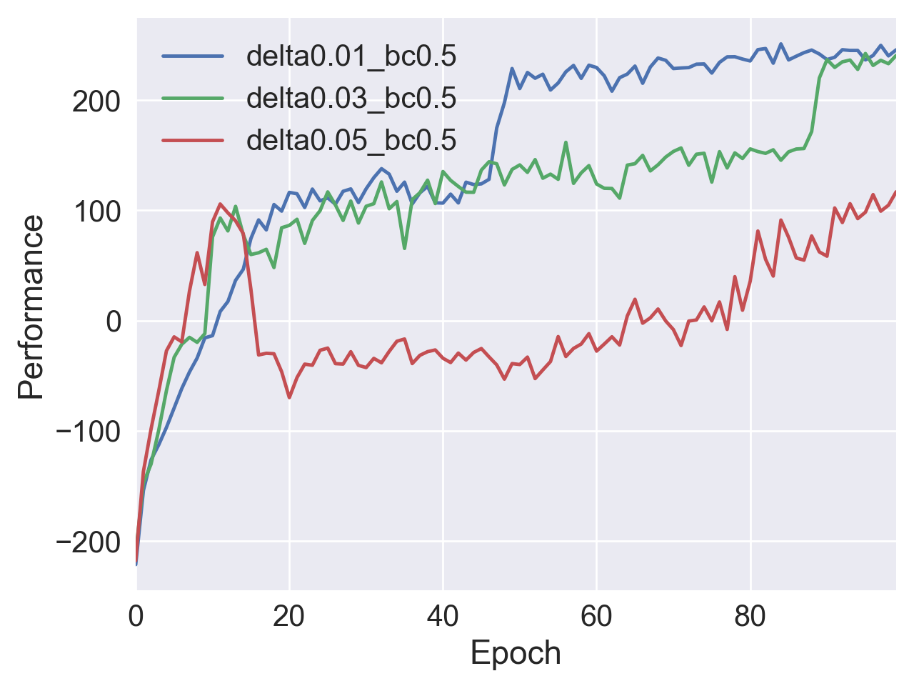
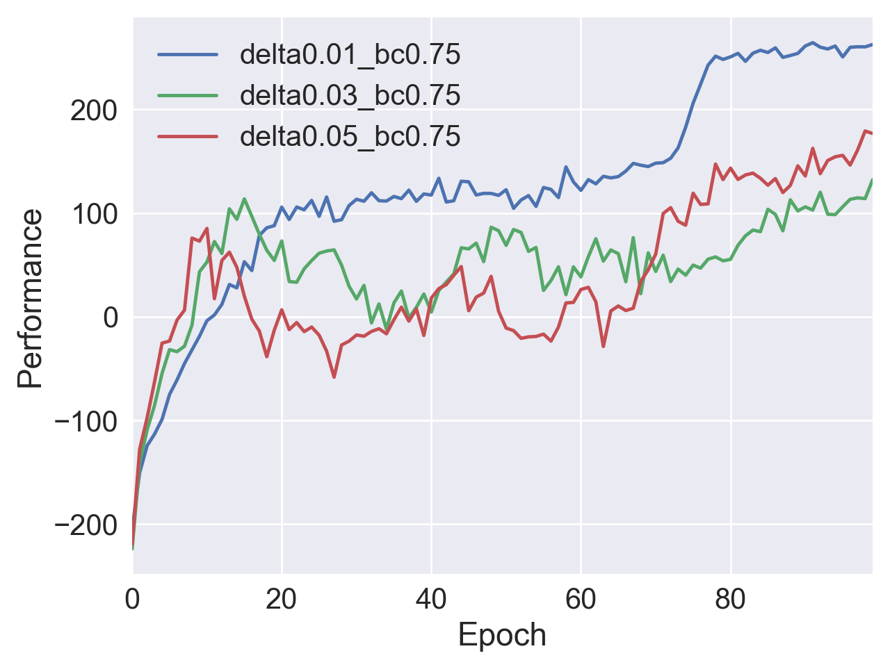

## Code

* train_pg_f18.py: implements policy gradient, used for all problems

* Problem 5:
 *  create_figures.py: create heatmap
 *  run_hyperparameter_search_IP.sh: create data for heatmap

* Problem 7:
  * train_spinning_up.py, train_ll_with_spinningup.sh: creates data for training
    VPG, TRPO, PPO implemented by spinning up from OpenAI
  * plots are created with with plot.py within this repository and the plotting
    routine provided by spinning up

## Dependencies
(from course notes)
 * Python **3.5**
 * Numpy version **1.14.5**
 * TensorFlow version **1.10.5**
 * MuJoCo version **1.50** and mujoco-py **1.50.1.56**
 * OpenAI Gym version **0.10.5**
 * seaborn
 * Box2D==**2.3.2**

Before doing anything, first replace `gym/envs/box2d/lunar_lander.py` with the provided `lunar_lander.py` file.

The only file that you need to look at is `train_pg_f18.py`, which you will implement.

See the [HW2 PDF](http://rail.eecs.berkeley.edu/deeprlcourse/static/homeworks/hw2.pdf) for further instructions.
