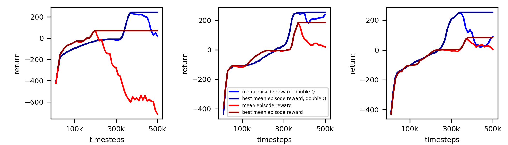
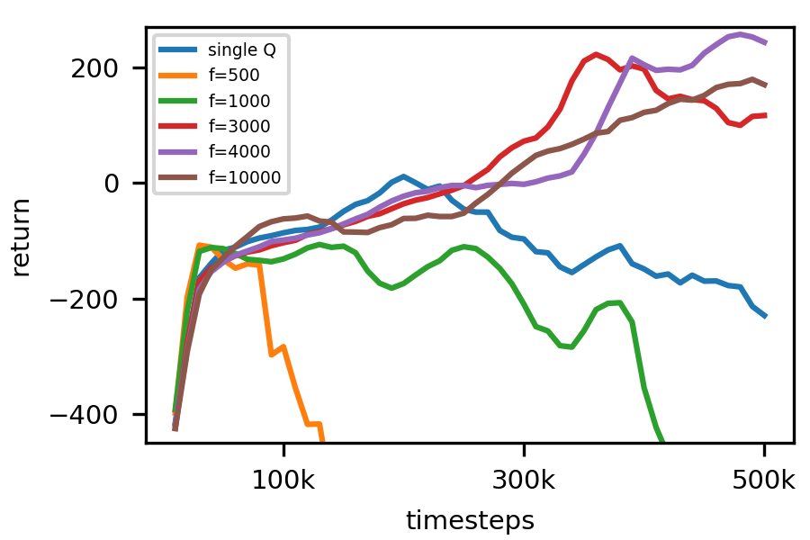
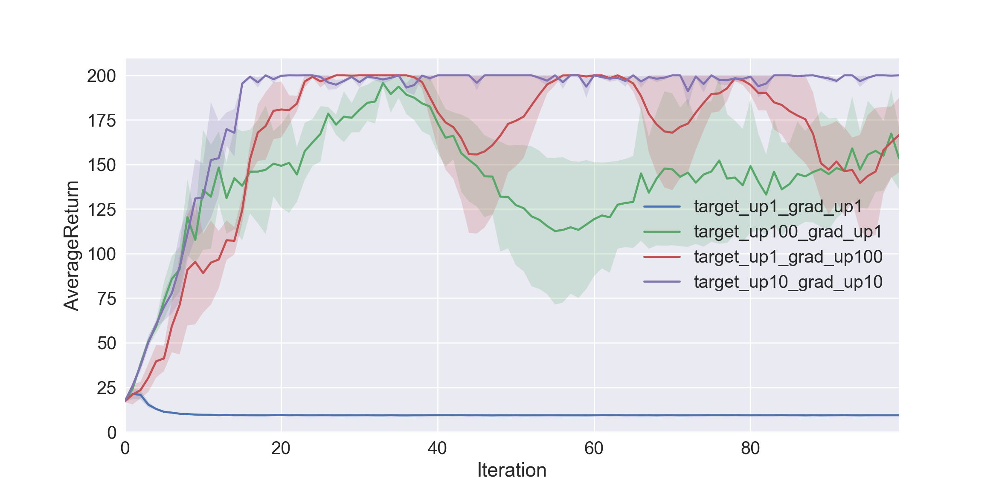
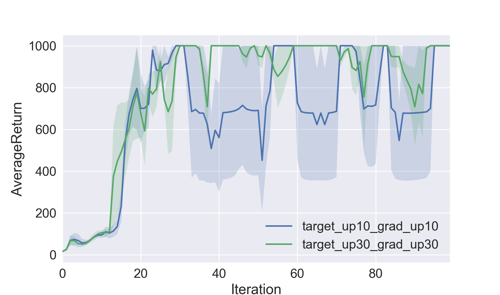
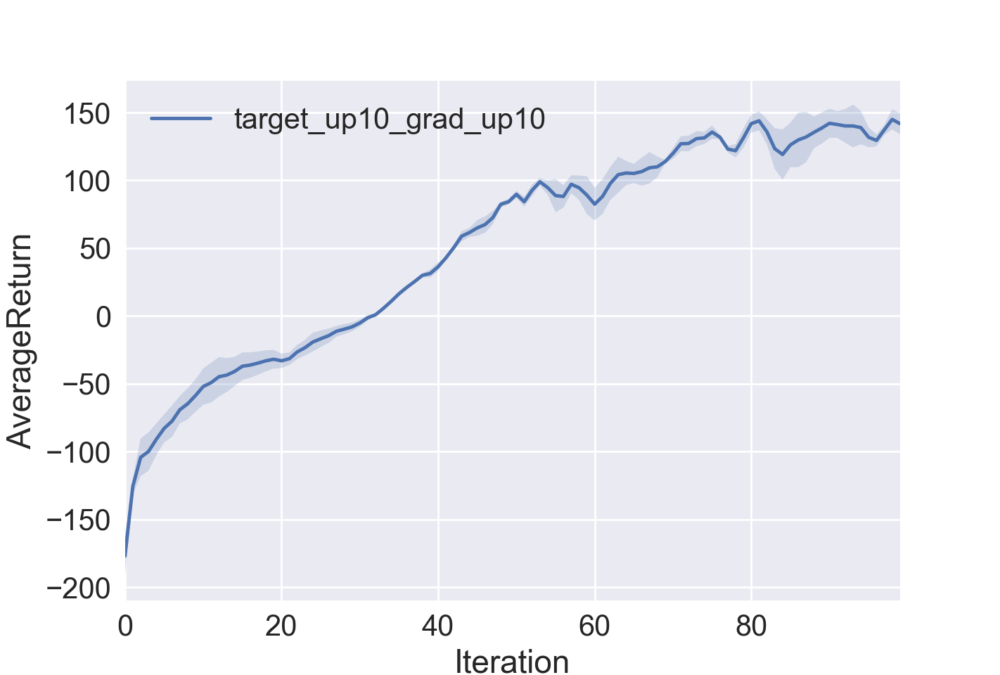

# CS294-112 HW 3: Q-Learning

## Q-learning (Part 1)

### Q-learning and double Q-learning

The figures below show the performance of Q-learning and double Q-learning in the LunarLander environment for three different seeds. In Q-learning
errors are propagated due to the maximum operation yielding overestimated Q-values.
Double Q learning counteracts this accumulation of errors by using two networks that feed each other, one for action selection and one for value evaluation. The figure
below shows that at the beginning of training Q-learning and double Q-learning
perform similarly, but after some training the performance of  Q-learning drops.

In practice we use the target network for the second Q-network. Thus one parameter that affects performance is the update frequency of the target network. The figure below shows the mean returns averaged over three seeds and various frequencies. Variability between trial is very large.
The parameter scan shows that training works for intermediate update frequencies. If the frequency is too low performance crashes as without the second Q-network due to the accumulation of errors. Performance is actually worse for small frequencies than without the second Q-network. If the frequency is too high performance drops since target and real Q-network deviate too much.

## Actor-Critic (Part 2)

### Cart Pole environment

Testing different number of target update steps for and gradient update steps for the critic network in the <em>CartPole-v0</em> environment shows that one update step is not sufficient (blue line). The training achieves highest reward and is most stable if the number of target and gradient steps are of the same order (purple line).

### Inverted Pendulum environment

Using 10 target and 10 gradient updates as above gives good performance in the <em>InvertedPendulum-v2</em> environment, but there are strong fluctuations. The latter can be reduced by increasing the number of target and gradient update steps to 30.

### Half Cheetah environment

## Code

* dqn.py: implements Q-learning
* create_figures.py: creates figures for Q-learning
* train_ac_f18.py: implements actor-critic algorithm
* plot.py: creates plots for actor-critic

## Dependencies
(from course notes)
 * Python **3.5**
 * Numpy version **1.14.5**
 * TensorFlow version **1.10.5**
 * MuJoCo version **1.50** and mujoco-py **1.50.1.56**
 * OpenAI Gym version **0.10.5**
 * seaborn
 * Box2D==**2.3.2**
 * OpenCV
 * ffmpeg

Before doing anything, first replace `gym/envs/box2d/lunar_lander.py` with the provided `lunar_lander.py` file.

The only files that you need to look at are `dqn.py` and `train_ac_f18.py`, which you will implement.

See the [HW3 PDF](http://rail.eecs.berkeley.edu/deeprlcourse/static/homeworks/hw3.pdf) for further instructions.

The starter code was based on an implementation of Q-learning for Atari generously provided by Szymon Sidor from OpenAI.
