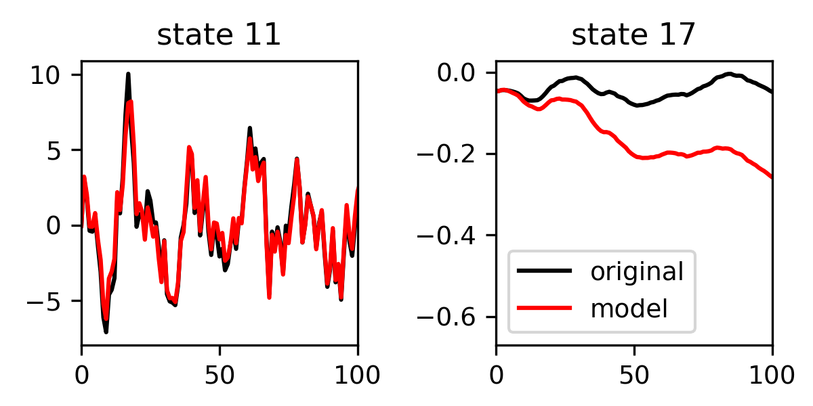
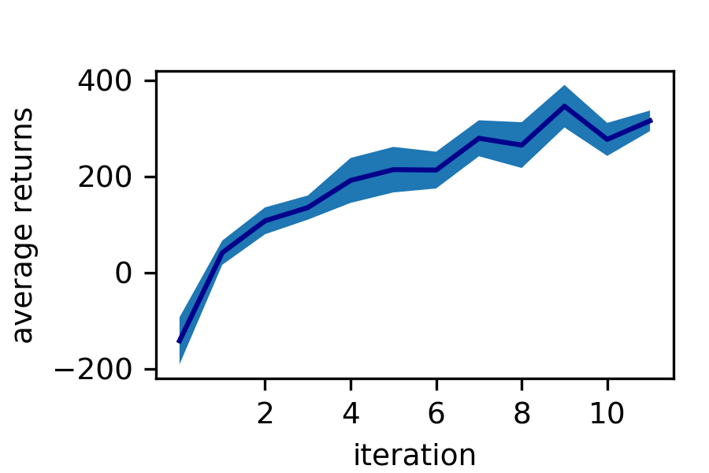
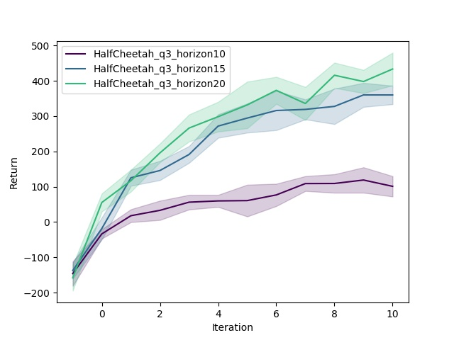
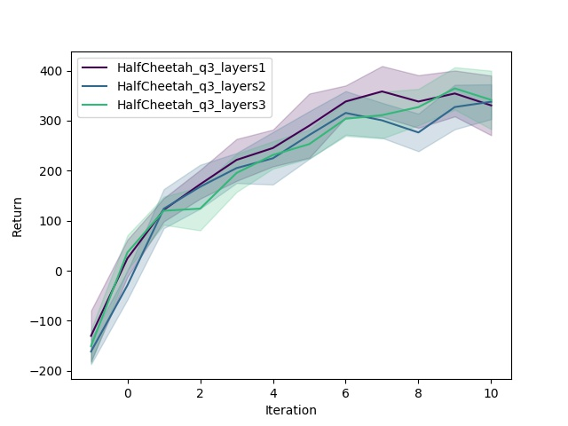

# CS294-112 HW 4: Model-Based RL

## Problem 1

The neural network is trained to learn the dynamics of the environment given
rollouts from a random policy. The figures below show a predictions of the model (red)
and the original dynamics (black) projected to two dimensions of the state. The prediction
works well for most states, but starts to drift for slowly varying states such as
state 17. This can happen for longer time series since this is an open-loop prediction
and there is no feedback between environment and model that could correct these
drifts.

## Problem 2

The random policy gets an average return of -156.236 with a standard deviation of 28.8962.
The trained policy gets an average return of  7.88174 with a standard deviation of 18.878.

## Problem 3

Averaged returns for 10 iterations of model based reinforcement learning. In each
iteration 10 rollouts generated by the current policy are added to the training data set.

Varying some hyperparameter shows that longer horizons give more reward and more
sampled action sequences give more reward. But increasing the number of layers in
the network has little effect.

See the [HW4 PDF](http://rail.eecs.berkeley.edu/deeprlcourse/static/homeworks/hw4.pdf) for further instructions.
