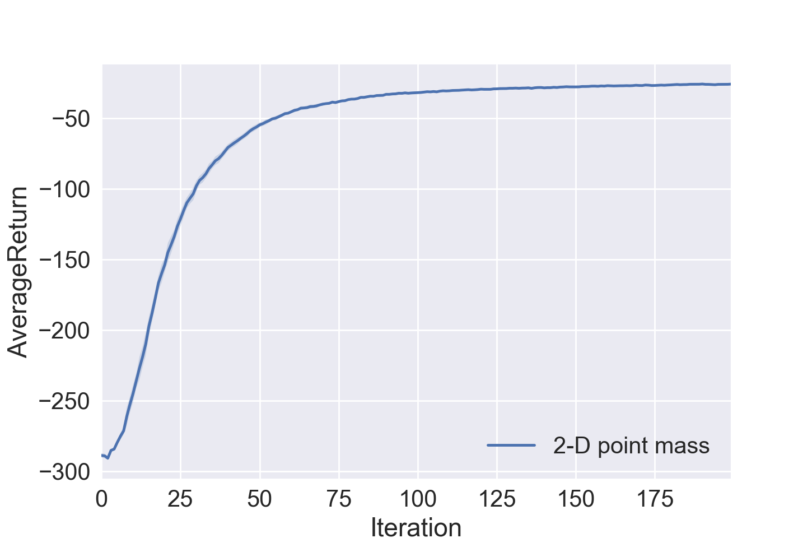
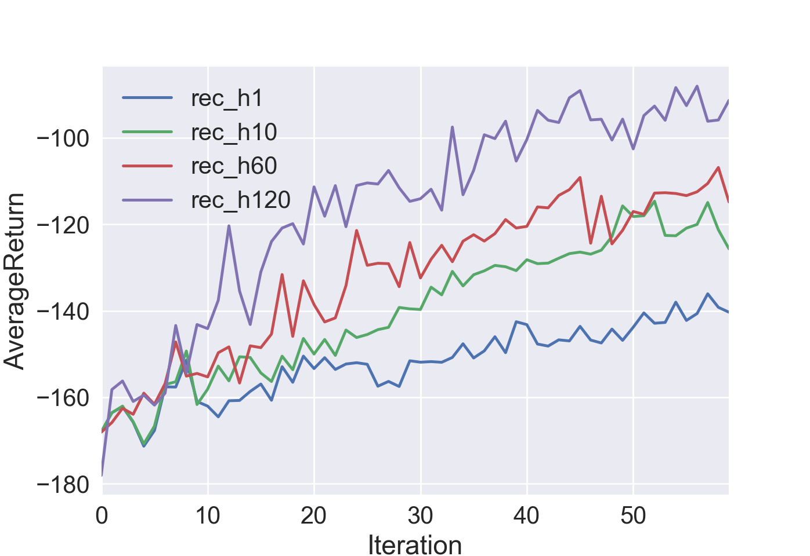
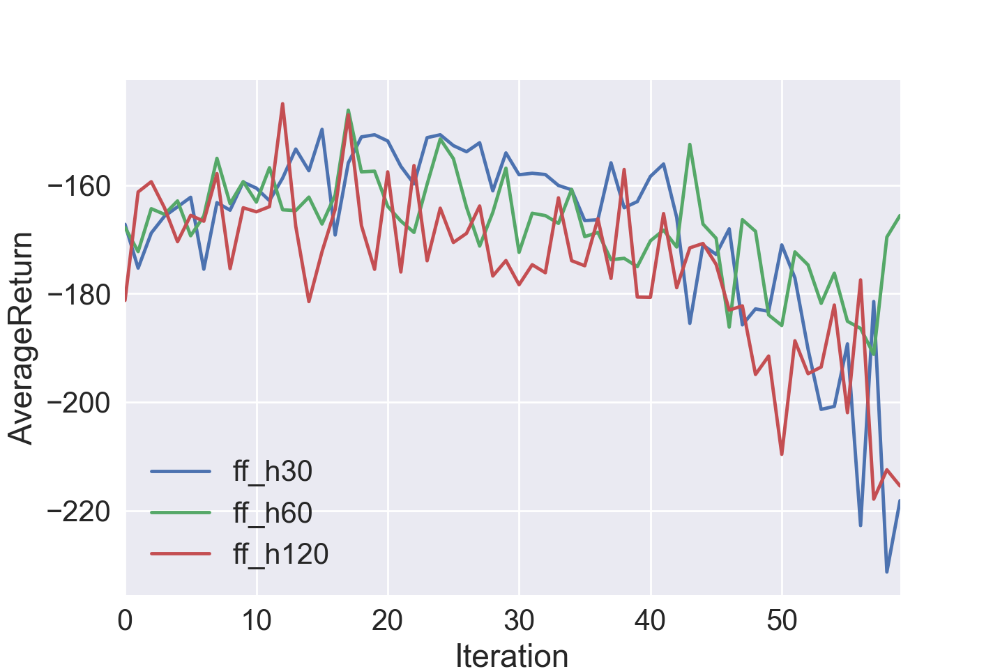
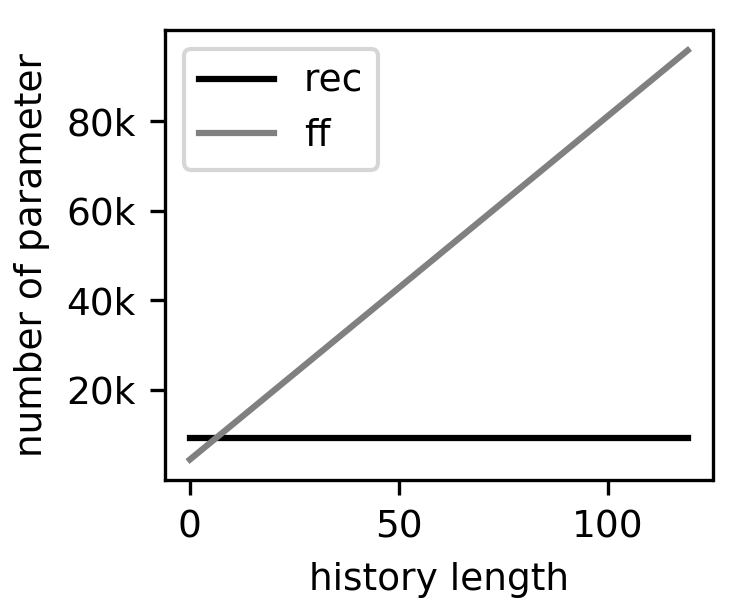

# CS294-112 HW 5c: Meta-Learning

## Problem 1

The figure below shows the averaged return after training the contextual policy within
the 2-D point mass environment averaged over three experiments.

## Problem 2

The figures below show training performance in the point mass environment, where the
agent has to infer the task. The first figure shows training with an additional
GRU layer depending on the history feed into the policy. Longer history gives better
training performance, but even a history of one gives same improvement. This is
not the case for a purely feedforward network (second figure). The third figure shows
that for small history length the recurrent and the feedforward network have
comparable number of parameter. However, the number of parameter of the latter
scales linearly with the history.

## Code

* point_mass.py/point_mass_observed.py: environments, the second has task identity as part of observation
* train_policy.py: trains the network
* create_figures.py: plots number of parameter

## Dependencies

 * Python **3.5**
 * Numpy version 1.14.5
 * TensorFlow version 1.10.5
 * MuJoCo version **1.50** and mujoco-py **1.50.1.56**
 * OpenAI Gym version **0.10.5**
 * seaborn
 * Box2D==2.3.2

See the [HW5c PDF](http://rail.eecs.berkeley.edu/deeprlcourse/static/homeworks/hw5c.pdf) for further instructions.
